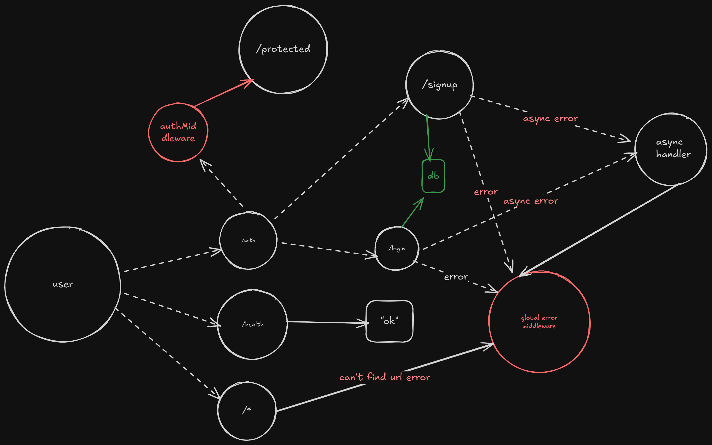
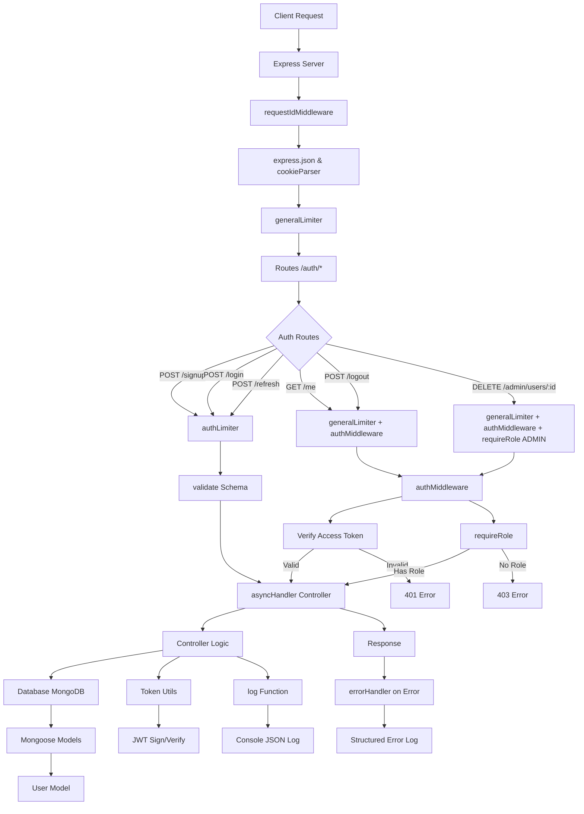

## 🏗️ System Architecture Diagram



# JWT Authentication Backend

This repository implements a secure, production-ready authentication system using Node.js and Express. It demonstrates modern backend practices for user management, token-based authentication, and session control, suitable for learning or as a foundation for larger applications.

## Technologies Used

- **Node.js**: Runtime environment for server-side JavaScript.
- **Express.js**: Web framework for building RESTful APIs, handling routing, middleware, and HTTP requests.
- **MongoDB**: NoSQL database for storing user data, using Mongoose for schema definition and data modeling.
- **JWT (JSON Web Tokens)**: For stateless authentication, generating access and refresh tokens.
- **bcrypt**: Library for hashing passwords securely.
- **Zod**: Schema validation for request bodies to ensure data integrity.
- **express-rate-limit**: Middleware to prevent abuse by limiting request rates.
- **cookie-parser**: Parses HTTP cookies for handling refresh tokens.
- **dotenv**: Manages environment variables for configuration.
- **crypto**: Node.js module for generating unique request IDs.

## Features

- User registration and login with email/password.
- JWT-based access tokens for API authorization.
- Refresh tokens stored in HTTP-only cookies for session management.
- Role-based access control (e.g., admin-only endpoints).
- Rate limiting to protect against brute-force attacks.
- Structured logging for debugging and monitoring.
- Request tracing in development mode.
- Error handling with custom middleware.
- Password hashing and secure token generation.

## Architecture Overview

The application follows a layered architecture with clear separation of concerns:

### System Flow
1. **Client Request**: Incoming HTTP requests are processed by Express.
2. **Middleware Stack**: Requests pass through global middlewares (e.g., JSON parsing, rate limiting, request ID generation).
3. **Routing**: Routes are defined in `src/routes/auth.routes.js`, applying specific middlewares like authentication and validation.
4. **Controllers**: Handle business logic, interact with the database, and generate responses.
5. **Database**: User data and refresh tokens are stored in MongoDB.
6. **Utilities**: Helper functions for token generation, logging, and async error handling.

### Key Components
- **Models** (`src/models/`): Define data schemas (e.g., User model with fields for name, email, password, role, and refresh token).
- **Controllers** (`src/controllers/`): Contain endpoint logic (e.g., signup, login, refresh).
- **Middlewares** (`src/middlewares/`): Handle cross-cutting concerns like authentication, validation, rate limiting, and error handling.
- **Utils** (`src/utils/`): Reusable functions for logging, token management, and async wrapping.
- **Validators** (`src/validators/`): Zod schemas for input validation.
- **Routes** (`src/routes/`): Define API endpoints and apply middlewares.

The Mermaid diagram above visualizes the request flow, showing how middlewares, routes, and controllers interconnect.

## API Endpoints

All endpoints are prefixed with `/auth`. Authentication is required for protected routes using `Authorization: Bearer <accessToken>`.

- `POST /auth/signup`: Register a new user. Requires name, email, password. Rate-limited.
- `POST /auth/login`: Authenticate user. Requires email, password. Returns access token and sets refresh cookie. Rate-limited.
- `POST /auth/refresh`: Refresh access token using refresh cookie. Rate-limited.
- `POST /auth/logout`: Invalidate session by clearing refresh token.
- `GET /auth/me`: Get current user details. Requires authentication.
- `DELETE /auth/admin/users/:id`: Delete a user (admin only). Requires authentication and admin role.
- `GET /auth/protected`: Example protected route. Requires authentication.

## Setup and Installation

1. **Prerequisites**: Node.js (v16+), MongoDB (local or cloud instance).
2. **Clone the Repository**:
   ```
   git clone <repository-url>
   cd <repository-folder>
   ```
3. **Install Dependencies**:
   ```
   npm install
   ```
4. **Environment Configuration**: Create a `.env` file in the root directory with:
   ```
   NODE_ENV=development
   PORT=3000
   MONGO_DB_URL=mongodb://localhost:27017/yourdb
   ACCESS_TOKEN_SECRET=your-access-secret
   REFRESH_TOKEN_SECRET=your-refresh-secret
   ACCESS_TOKEN_EXPIRES_IN=15m
   REFRESH_TOKEN_EXPIRES_IN=7d
   ```
5. **Run the Server**:
   ```
   npm run dev
   ```
   The server starts on `http://localhost:3000`. Use tools like Postman or curl for testing.

## Usage

### Example: User Signup
Send a POST request to `/auth/signup` with JSON body:
```json
{
  "name": "John Doe",
  "email": "john@example.com",
  "password": "securepassword"
}
```
Response includes an access token; refresh token is set in cookie.

### Example: Accessing Protected Route
Include the access token in the header:
```
Authorization: Bearer <accessToken>
```

For token refresh, call `/auth/refresh` after access token expiry.

## Security Considerations

- **Tokens**: Access tokens are short-lived and stateless; refresh tokens are long-lived but stored securely in HTTP-only cookies and database.
- **Passwords**: Hashed with bcrypt (salt rounds: 10).
- **Rate Limiting**: Prevents abuse (e.g., 5 auth attempts per minute).
- **Cookies**: Configured with `httpOnly`, `sameSite: strict` to mitigate XSS and CSRF.
- **Validation**: Zod ensures input sanitization.
- **Logging**: Structured JSON logs aid in monitoring and debugging.
- **Session Control**: Refresh tokens can be revoked via logout or database invalidation.

This setup balances security, performance, and usability, following industry standards for JWT authentication.

## Contributing

Contributions are welcome. Please follow standard practices: fork, create a feature branch, and submit a pull request. Ensure tests pass and code is linted.

## License

ISC License.
```
